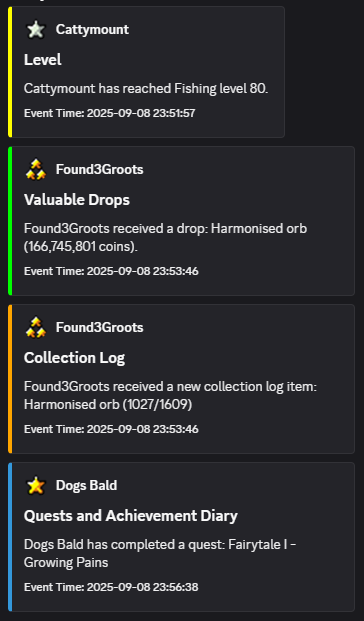
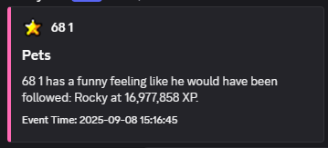

# ⚔️ Clan Broadcasts

A RuneLite plugin that brings your clan's broadcasts into your Discord.  
Whenever a clan member gets a pet, a drop, a level-up, or makes a clan coffer change, it’s instantly posted to your Discord server.

---

## ❓ What the plugin do?
- Automatic posting of clan broadcasts to Discord
- Rank-based icons (via Wise Old Man group integration)
- Colored embeds by event type (drops, pets, quests, PVM, etc.)
- Duplicate prevention — no repeated spam
- Separate Discord webhooks for each category:
    - General
    - Valuable Drops
    - Collection Log
    - Pets
    - PVM / PVP
    - Levels
    - Quests & Diaries
    - 99s & Capes
    - Clan’s Coffer

---

## ⚙️ Setup
Easy to configure your settings in RuneLite:
- Wise Old Man group ID (for rank icons)
- Relay URL - if you wish to self-host
- Webhook URLs for your Discord channels

---

## ✅ What to Expect
- Clean, formatted Discord messages for every clan event
- Icons matching clan member ranks
- Reliable forwarding through a relay server
- Easy setup with just a few webhook links

---

## 📜 License
MIT License — free to use and share.  
